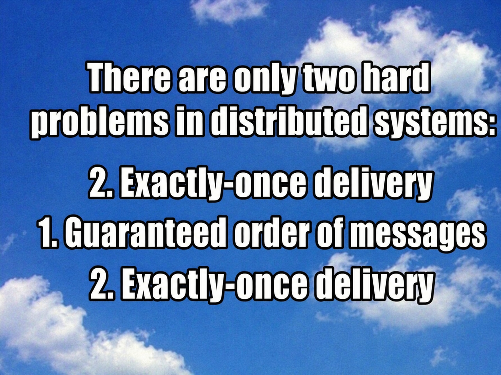

# Money Laundering Analysis



Distributed pipeline that runs 5 use cases over transaction datasets.

## Requirements

- Docker and Docker Compose
- [uv](https://github.com/astral-sh/uv)
- Datasets placed in `datasets/`

## Configuration

The dataset and client count are set in `scripts/cfg.py` (`TRANSACTIONS_PATH`, `ACCOUNTS_PATH`, `NCLIENTS`).

## Running

```
make gen_input_output   # generate per-client input and expected responses
make up                 # build images and start the system
make test               # validate the responses against the oracle
make down               # stop and remove everything
```

Other helpers: `make logs`, `make stop_server`.

## Fault tolerance

Inject and inspect failures by hand on a running cluster:

```
make supervisor                 # follow the supervisors' logs
make chaos                      # arm the chaos monkey (kills random nodes)
make chaos_stop                 # disarm the chaos monkey
make nodes                      # list killable nodes
make kill NODE=join_0           # kill specific nodes (comma-separated)
make kill_prefix PREFIX=uc4     # kill a whole ring/group by prefix
make dead                       # list downed nodes
make revive NODE=join_0         # bring nodes back
make revive_prefix PREFIX=uc4   # revive a whole group
```

## Benchmarks

```
make test_ft             # fault-tolerance e2e: crash each controller, verify recovery
make test_ft_client      # same, restricted to client-crash points
make scalability_test    # run several ring topologies per dataset tier
make performance_vs_ft   # chaos + checkpoint sweeps, dumps results and figures
make perf_plots          # re-render the figures from an existing results.csv
```
