# Money Laundering Analysis
* 108397 - Ordoñez Alejo
* 107863 - Minervino Lorenzo
* 106010 - Valsagna Federico

## Arquitectura del sistema
### Casos de uso

### Vista física
#### Robustez

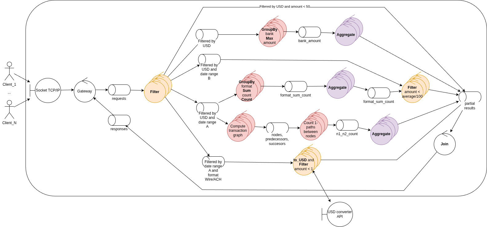

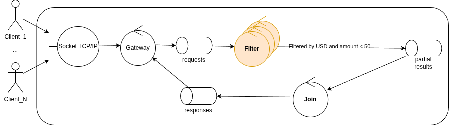

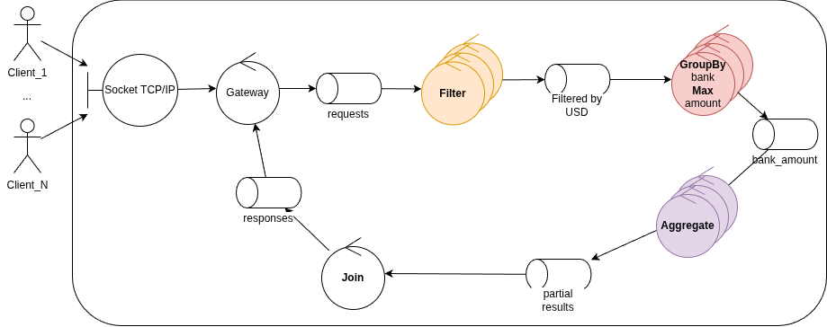

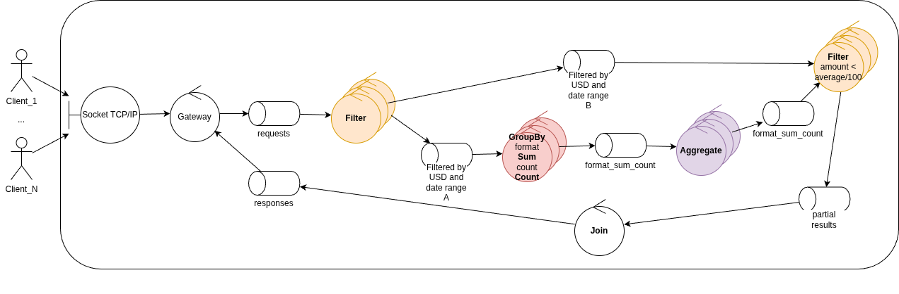

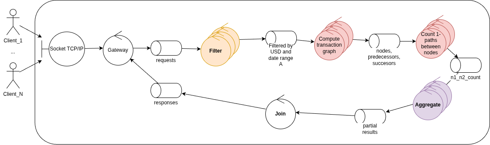

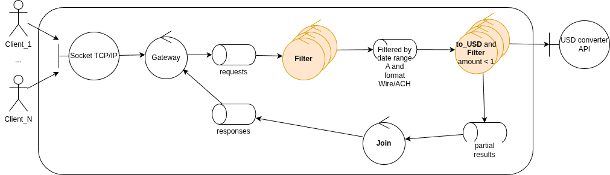

#### Despliegue

### Vista de procesos
#### Actividades

#### Secuencia

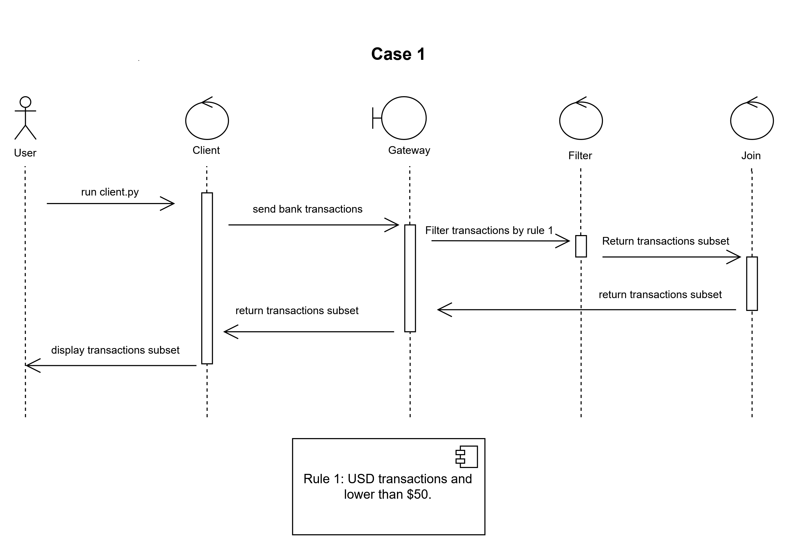

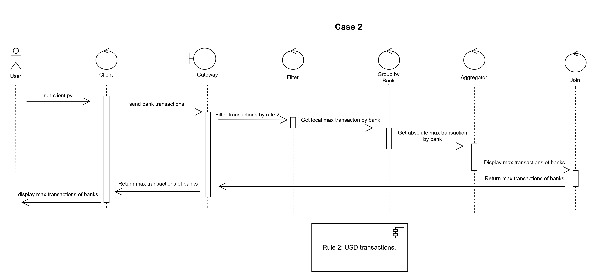

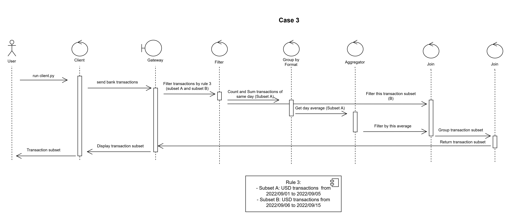

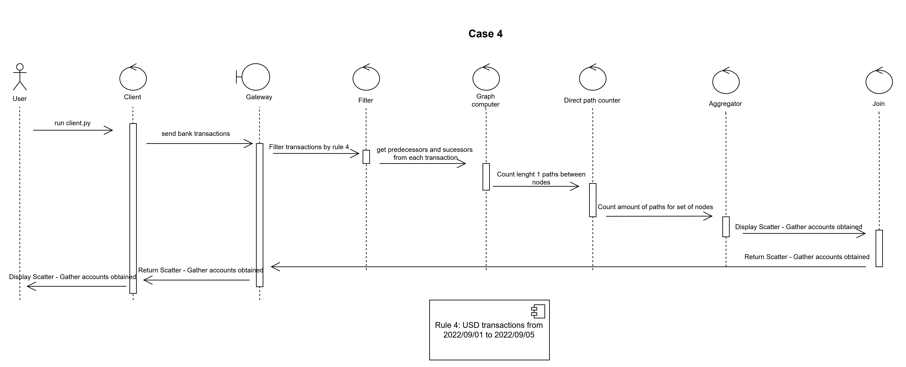

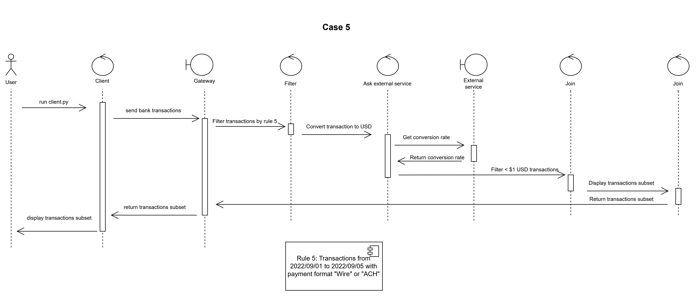

### Vista de desarrollo
#### Paquetes

