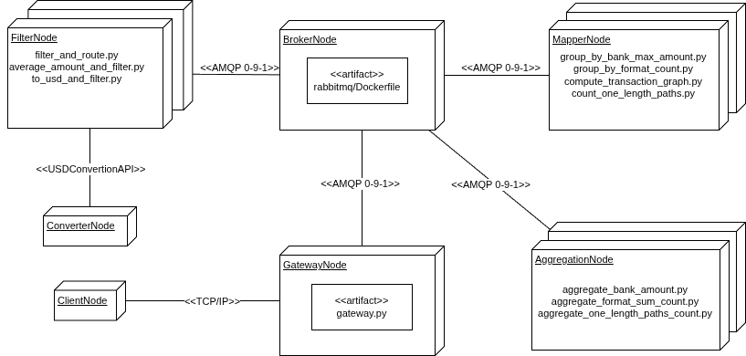
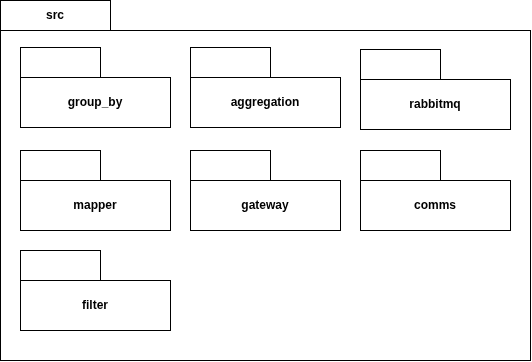
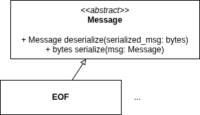
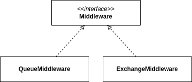

# Arquitectura del sistema

El sistema recibe un conjunto de datos de transacciones bancarias desde uno o más clientes simultáneamente y devuelve los resultados de cinco análisis distintos. La diversidad de los requerimientos, que abarcan desde un filtro simple hasta la detección de patrones en grafos y la consulta a servicios externos, motivó el diseño de una arquitectura de procesamiento distribuido en pipeline, donde cada caso de uso recorre una cadena de nodos especializados de forma concurrente con los demás.

## Casos de uso

Una petición del cliente hace que el sistema procese los 5 casos de uso:

### UC1
Transacciones en USD con monto menor a 50.

### UC2
Monto de la máxima transacción en USD para cada banco.

### UC3
Transacciones en USD en el período 2022-09-06 al 2022-09-15 (período B), cuyo monto sea menor a un centésimo del promedio de monto para su formato en el período 2022-09-01 al 2022-09-05 (período A).

### UC4
Cuentas que cumplan con el patrón *scatter-gather* con una cuenta de separación y una cantidad mínima de cuentas intermedias igual a 5; en el período A.

### UC5
Cantidad de transacciones con formato de pago *Wire* o *ACH* en el período A, cuyo monto en USD sea menor a 1.

{width=50%}

Los cinco casos de uso presentan niveles crecientes de complejidad: desde un filtro directo (UC1) hasta la detección de estructuras en un grafo de transacciones (UC4) o la normalización de moneda contra un servicio externo (UC5). Esta escalera de complejidad da forma a la arquitectura del sistema y se verá reflejada en cada una de las vistas que siguen.

\newpage

## DAG de procesamiento

El conjunto de pipelines puede modelarse como un DAG (*Directed Acyclic Graph*): un grafo dirigido sin ciclos donde cada nodo representa una transformación y cada arista un stream de registros tipados. La ausencia de ciclos garantiza que el procesamiento siempre converge y que las dependencias entre etapas son explícitas: un nodo solo puede procesar datos cuando sus predecesores ya los produjeron.

### UC1 — Filtro directo

{width=50%}

UC1 establece el patrón base del sistema. El Gateway entrega el registro completo (origin, destination, amount, format) y el Filter aplica dos condiciones simultáneas: moneda USD y monto menor a \$50. Los registros que las satisfacen salen como (origin, destination, amount) hacia el Join. El campo `format` se descarta en esta etapa porque no aporta información al resultado.

Cada transacción se evalúa de forma completamente independiente de las demás. No hay computación entre filas, por lo que el pipeline puede procesar los registros en cualquier orden y en paralelo sin afectar la correctitud del resultado.

### UC2 — Máximo por banco

{width=55%}

UC2 introduce dos conceptos nuevos respecto de UC1: múltiples fuentes de datos y agregación en dos etapas. El nodo Route client data distribuye dos streams simultáneamente: registros de transacciones (bank_id, origin, amount) hacia el pipeline de filtrado, y registros de cuentas (bank_id, bank_name) hacia un GroupBy de resolución de nombres.

El pipeline de transacciones filtra por USD y luego el GroupBy calcula el máximo de `amount` por `bank_id` dentro de cada partición. El Aggregate consolida esos máximos parciales en el máximo global definitivo por banco.

En paralelo, el pipeline de cuentas construye el mapeo bank_id → bank_name mediante el GroupBy bank_id On bank_name. Ambas pipelines convergen en el Merge On bank_id, que enriquece cada máximo con el nombre legible del banco y produce (bank_name, origin, max_amount) para el Join.

La separación es deliberada: el dataset de transacciones solo contiene `bank_id`, no el nombre del banco. Resolver el mapeo dentro del Filter introduciría dependencia de estado global en el componente de mayor throughput del sistema; correr el enriquecimiento como pipeline paralelo independiente y unir al final evita ese problema.

### UC3 — Comparación entre períodos

{width=55%}

UC3 requiere comparar transacciones de dos períodos distintos: el umbral (amount < promedio_de_formato / 100) no es un valor fijo sino que depende del promedio global de cada formato en el período A, que solo se conoce una vez que se procesaron todos los datos de ese período.

El nodo Route client data envía el stream a dos Filters en paralelo: uno selecciona USD y período A, el otro selecciona USD y período B.

El pipeline del período A materializa los promedios por formato: el GroupBy format Sum amount Count acumula suma y conteo por formato en cada partición, y el Aggregate computa el promedio real (sum/count). La salida es (format, average).

El pipeline del período B produce el stream crudo de transacciones candidatas: (origin, amount, format).

El Merge combina ambas salidas usando el formato como clave, de modo que cada transacción del período B queda asociada con el promedio de su formato en el período A. Un Filter final aplica la condición amount < average/100 y produce (origin, amount) para el Join.

La estructura de dos etapas, primero materializar promedios y luego filtrar el período B, es consecuencia directa de la dependencia lógica: ninguna transacción del período B puede evaluarse hasta que el promedio de su formato en el período A sea conocido.

### UC4 — Patrón scatter-gather

{width=55%}

UC4 requiere detectar el patrón scatter-gather en el grafo de transacciones: una cuenta origen dispersa fondos hacia múltiples intermediarios, que los concentran en una cuenta destino. Esta detección no puede hacerse registro a registro.

Después del filtro inicial (USD y período A), el GroupBy origin/destination Compute graph construye la representación del grafo: para cada nodo acumula el conjunto de predecesores y sucesores observados. La salida es (node, predecessors, successors).

El GroupBy one length paths Count toma esa representación y cuenta las rutas de un salto para cada par (origin, destination): la cantidad de cuentas que sirven como intermediario directo entre ese origen y ese destino. Este conteo corresponde directamente al número de cuentas intermediarias en el patrón scatter-gather.

El Aggregate one length paths consolida los conteos parciales de las distintas instancias del GroupBy, produciendo el conteo global definitivo por par. El resultado (origin, destination, count) llega al Join.

### UC5 — Conteo con conversión de moneda

{width=50%}

UC5 cuenta cuántas transacciones de formato Wire o ACH en el período A tienen un monto menor a \$1 USD. Los montos pueden estar expresados en cualquier moneda, por lo que la comparación con el umbral solo es válida después de convertir.

El Filter inicial aplica formato (Wire o ACH) y período A para reducir el dataset antes de la etapa de conversión. Filtrar primero es intencional: cuantos menos registros lleguen al conversor, menos llamadas al servicio externo son necesarias.

El nodo Convert amount into USD traduce cada monto a su equivalente en dólares, asumiendo tipo de cambio estable dentro del batch. El Filter siguiente aplica el umbral de \$1. Las transacciones que lo superan llegan al GroupBy * Count, donde el `*` indica que no hay clave de agrupación: todos los registros se colapsan en un único contador global. Ese conteo es el resultado final de UC5.

\newpage

## Robustez

El diagrama de robustez muestra cómo se despliegan físicamente los pipelines: qué componentes concretos existen, qué colas los conectan, cuántas instancias corren en paralelo y qué estrategia de ruteo usa cada etapa.

### UC1

{width=80%}

El Filter puede correr con múltiples instancias en paralelo (indicado por el símbolo apilado), cada una procesando una partición del stream. Dado que el Join también escala horizontalmente, todos los resultados de un mismo cliente deben llegar siempre a la misma instancia del Join, que es la única que mantiene su conexión TCP/IP. Esto se implementa como shardeo por `client_id` en la cola de salida del Filter.

La cola de Responses desacopla el Join del Gateway: el Join deposita los resultados en la cola y el Gateway los consume para cerrar la conexión correspondiente. Múltiples clientes pueden operar simultáneamente sin interferir entre sí.

### UC2

{width=75%}

El Gateway publica en dos colas distintas: `Transactions` para el stream de transacciones y `Accounts` para el dataset de cuentas.

El pipeline de transacciones usa shardeo por `bank_id` en cada etapa: el GroupBy bank Max amount recibe registros del mismo banco en la misma instancia, y el Aggregate max amounts mantiene ese shardeo para consolidar los parciales correctamente.

El pipeline de cuentas corre en paralelo: el GroupBy bank_id On bank_name extrae asociaciones (bank_id, bank_name) de cada partición y el Aggregate bank names las consolida. El resultado se distribuye al Merge también con shardeo por `bank_id`.

El Merge On bank_id recibe máximos con `bank_id` como clave desde el pipeline de transacciones y nombres de banco desde el pipeline de cuentas. El shardeo consistente por `bank_id` a lo largo de ambas pipelines garantiza que cada instancia del Merge reciba todos los datos del mismo banco de ambas fuentes, condición necesaria para que el join sea correcto.

### UC3

{width=80%}

El Filter produce dos colas de salida distintas: `Filtered by USD and period A` y `Filtered by USD and period B`. Además de evaluar el predicado de moneda, rutea cada transacción al pipeline correspondiente según su fecha. Una transacción no puede pertenecer a ambos períodos, por lo que el ruteo es mutuamente exclusivo.

El pipeline del período A usa shardeo por `format` entre el GroupBy y el Aggregate para que todos los registros del mismo formato lleguen a la misma instancia.

Los promedios resultantes se distribuyen al Merge mediante fan-out: cada resultado del Aggregate se replica a todas las instancias del Merge. Cualquier instancia del Merge puede recibir transacciones del período B de cualquier formato y necesita los promedios de todos los formatos para evaluar la condición; el shardeo enviaría cada promedio a una sola instancia, mientras que el fan-out garantiza que todas tengan el contexto completo. Por la naturaleza del problema asumimos que los disitntos tipos de formato no son muchos, por lo que no es un problema grave que cada isntancia reciba el mapeo completo.

Después del Merge, un segundo Filter aplica la condición amount < average/100 y produce la cola final hacia el Join.

### UC4

{width=75%}

El GroupBy Compute graph genera para cada nodo la lista de predecesores y sucesores. Para que esta computación sea correcta, todas las aristas incidentes a un mismo nodo deben llegar a la misma instancia, lo que se logra con shardeo por `node`.

El GroupBy one length paths Count cuenta los intermediarios por par (origin, destination). Para consolidar correctamente, todos los datos del mismo par deben llegar a la misma instancia, lo que se logra con shardeo por (predecessor, successor).

Un Filter final descarta los pares cuyo conteo de intermediarios es inferior a 5, produciendo la cola "Nodes that match scatter gather pattern w/ at least 5 intermediate nodes" que llega al Join. Este filtro es un componente separado del Aggregate porque la condición de umbral ($\geq$ 5) es lógica de negocio: mantenerla separada del pipeline de conteo facilita modificarla sin alterar el resto.

### UC5

{width=80%}

El nodo Convert amount into USD puede escalar horizontalmente de forma independiente del Filter. Cada instancia emite una sola request al USD conversion external service API por batch, amortizando la latencia de red sobre el conjunto del lote.

El GroupBy * Count produce conteos parciales, uno por instancia. Estos se shardean por `client_id` hacia el Join correcto.

### Sistema completo

{width=90%}

El Filter es el nodo con mayor abanico de conexiones: recibe el stream completo de transacciones y produce múltiples colas clasificadas por período, formato y moneda. Su escalado horizontal genera una topología many-to-many con los nodos downstream que debe gestionarse a nivel de exchanges y colas del broker.

Dos estrategias de distribución coexisten en el sistema. El shardeo por clave (`bank_id`, `node`, `format`, `client_id`) es la estrategia predeterminada en todas las etapas de agregación y merge: garantiza que todos los registros de un mismo grupo lleguen a la misma instancia. El fan-out se usa en UC3 para los promedios del período A: cuando el resultado de una etapa es contexto global que todas las instancias downstream necesitan completo, el shardeo no alcanza y es necesario replicar.

El Join está siempre shardeado por `client_id`, garantizando que todos los resultados parciales de un cliente, provenientes de cualquiera de las cinco pipelines, converjan en la instancia para poder construir la respuesta final.

Los nodos Merge (UC2, UC3) son los únicos puntos donde se cruzan pipelines que provienen de fuentes distintas. Fuera de esos dos casos, cada pipeline corre de extremo a extremo sin interacción con las demás.

\newpage

## Despliegue

{width=90%}

\newpage

## Paquetes

{width=70%}

{width=60%}

{width=60%}

\newpage

## Actividades

{width=90%}

### UC1

{width=70%}

### UC2

{width=70%}

### UC3

{width=70%}

### UC4

{width=70%}

### UC5

{width=70%}

## Secuencia

### UC1

{width=90%}

### UC2

{width=90%}

### UC3

{width=90%}

### UC4

{width=90%}

### UC5

{width=90%}

\newpage

# Desarrollo

## Tareas a realizar
Para el desarrollo del trabajo, se decidió que cada uno de los integrantes realice la implementación de uno o más casos de uso de punta a punta; con el objetivo de que todos podamos tener un seguimiento del total funcionamiento del sistema, pero sin la necesidad de entrar de lleno en los detalles específicos de cada caso de uso.

## Asignación
Aquellas tareas de las que dependan todas los casos, serán desarrolladas en una primera implementación por todos los miembros del equipo, y serán modificadas como se requiera por quien lo necesite a lo largo de la continuación del trabajo.  
El primer caso de uso será desarrollado en gran medida con la dinámica de *ping-pong pair-programming*; con el objetivo de usar el caso más simple para la interiorización de la implementación del trabajo para todos los miembros del equipo en paralelo.  
El resto de ítems quedan divididos de la siguiente manera:

- UC1: Todos
- UC2: Lorenzo Minervino
- UC3: Valsagna Federico.
- UC4: Ordoñez Alejo.
- UC5: Lorenzo Minervino.
