# Arquitectura del sistema

El sistema recibe un conjunto de datos de transacciones bancarias desde uno o más clientes simultáneamente y devuelve los resultados de cinco análisis distintos. La diversidad de los requerimientos, que abarcan desde un filtro simple hasta la detección de patrones en grafos y la consulta a servicios externos, motivó el diseño de una arquitectura de procesamiento distribuido en pipeline, donde cada caso de uso recorre una cadena de nodos especializados de forma concurrente con los demás.

## Casos de uso
<!-- agregar lo que tiene q llegarle al cliente de cada uc -->
Una petición del cliente hace que el sistema procese los 5 casos de uso:

### UC1
Transacciones en USD con monto menor a \$50.

### UC2
Monto de la máxima transacción en USD para cada banco.

### UC3
Transacciones en USD en el período 2022-09-06 al 2022-09-15 (período B), cuyo monto sea menor a un centésimo del promedio de monto para su formato en el período 2022-09-01 al 2022-09-05 (período A).

### UC4
Cuentas que cumplan con el patrón *scatter-gather* con una cuenta de separación y una cantidad mínima de cuentas intermedias igual a 5; en el período A.

### UC5
Cantidad de transacciones con formato de pago *Wire* o *ACH* en el período A, cuyo monto en USD sea menor a 1.

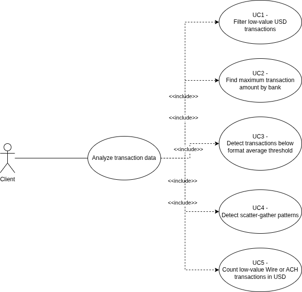{width=50% .center}

Los cinco casos de uso presentan niveles crecientes de complejidad: desde un filtro directo (UC1) hasta la detección de estructuras en un grafo de transacciones (UC4) o la normalización de moneda contra un servicio externo (UC5). Esta escalera de complejidad da forma a la arquitectura del sistema y se verá reflejada en cada una de las vistas que siguen.

\newpage

## DAG de procesamiento

El conjunto de pipelines puede modelarse como un DAG (*Directed Acyclic Graph*). La ausencia de ciclos garantiza que el procesamiento siempre converge y que las dependencias entre etapas son explícitas: un nodo solo puede procesar datos cuando sus predecesores ya los produjeron.

### UC1 — Filtro directo

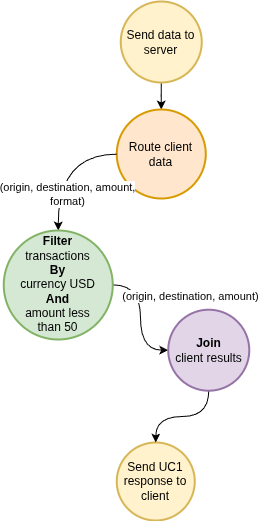{width=50% .center}

UC1 establece el patrón base del sistema. El **Gateway** entrega el registro completo `(origin, destination, amount, format)` y el **Filter** aplica dos condiciones simultáneas: moneda USD y monto menor a \$50. Los registros que las satisfacen salen como `(origin, destination, amount)` hacia el **Join**. El campo `format` se descarta en esta etapa porque no aporta información al resultado.

Cada transacción se evalúa de forma completamente independiente de las demás. No hay computación entre filas, por lo que el pipeline puede procesar los registros en cualquier orden y en paralelo sin afectar la correctitud del resultado.

### UC2 — Máximo por banco

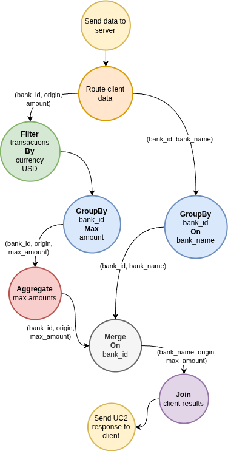{width=55% .center}

UC2 introduce dos conceptos nuevos respecto de UC1: múltiples fuentes de datos y agregación en dos etapas. Primero se distribuyen dos streams simultáneamente: registros de transacciones `(bank_id, origin, amount)` hacia el pipeline de filtrado, y registros de cuentas `(bank_id, bank_name)` hacia un **GroupBy** de resolución de nombres.

El pipeline de transacciones filtra por USD y luego el GroupBy calcula el máximo de `amount` por `bank_id` dentro de cada partición. El **Aggregate** consolida esos máximos parciales en el máximo global definitivo por banco.  
En paralelo, el pipeline de cuentas construye el mapeo `bank_id` → `bank_name` mediante el GroupBy bank_id On bank_name. Ambos pipelines convergen en el **Merge**, que agrega el nombre del banco a cada máximo, produciendo `(bank_name, origin, max_amount)` para el Join.

### UC3 — Comparación entre períodos

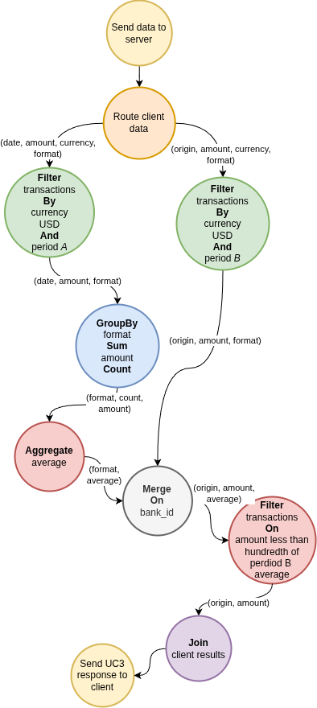{width=55% .center}

UC3 requiere comparar transacciones de dos períodos distintos: el umbral `(amount < promedio_de_formato / 100)` no es un valor fijo sino que depende del promedio global de cada formato en el período A, que solo se conoce una vez que se procesaron todos los datos de ese período.

Primero se divide el stream de datos en dos bifurcaciones a ser procesadas en paralelo: una con currency USD y período A y la otra con currency USD y período B.  
El pipeline del período A materializa los promedios por formato: el GroupBy format Sum amount Count acumula suma y conteo por formato en cada partición, y el Aggregate computa el promedio real (`sum/count`). La salida es `(format, average)`.  
El pipeline del período B produce el stream crudo de transacciones candidatas: `(origin, amount, format)`.  
El Merge combina ambas salidas usando el formato como clave, de modo que cada transacción del período B queda asociada con el promedio de su formato en el período A.  
Un Filter final aplica la condición amount < average/100 y produce (origin, amount) para el Join.

### UC4 — Patrón scatter-gather

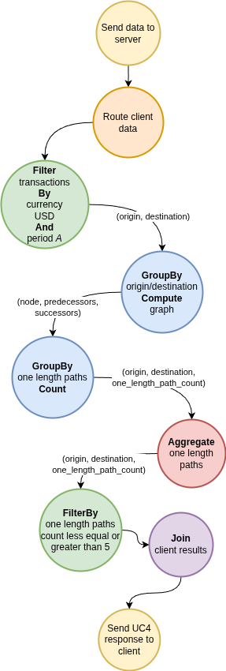{width=55% .center}

UC4 requiere detectar el patrón *scatter-gather* en el grafo de transacciones: una cuenta origen dispersa fondos hacia múltiples intermediarios, que los concentran en una cuenta destino. Esta detección no puede hacerse registro a registro.  

Después del filtro inicial (currency USD y período A), el GroupBy construye la representación del grafo: para cada nodo acumula el conjunto de predecesores y sucesores observados. La salida es `(node, predecessors, successors)`.  
El próximo GroupBy toma esa representación y cuenta las rutas de un salto para cada par `(origin, destination)`: la cantidad de cuentas que sirven como intermediario directo entre ese origen y ese destino. Este conteo corresponde directamente al número de cuentas intermediarias en el patrón scatter-gather.  
Por último, el Aggregate consolida los conteos parciales de las distintas instancias del GroupBy, produciendo el conteo global definitivo por par, que es luego filtrado según la cantidad mínima de cuentas intermediarias del patrón.  
El resultado `(origin, destination)` llega al Join.

### UC5 — Conteo con conversión de moneda

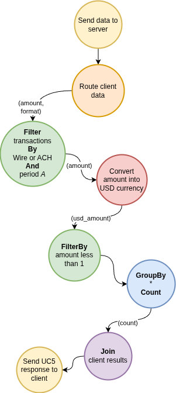{width=50% .center}

UC5 cuenta cuántas transacciones de formato Wire o ACH en el período A tienen un monto menor a \$1 USD. Los montos pueden estar expresados en cualquier moneda, por lo que la comparación con el umbral solo es válida después de convertir.

El Filter inicial aplica formato (Wire o ACH) y período A para reducir el dataset antes de la etapa de conversión.  
El paso de conversión traduce cada monto a su equivalente en dólares. El Filter siguiente aplica el umbral de \$1. Las transacciones que lo superan llegan al GroupBy * Count, donde el `*` indica que no hay clave de agrupación: todos los registros se colapsan en un único contador global.  
Ese conteo es el resultado final de UC5.

\newpage

## Vista física
### Robustez

El diagrama de robustez muestra cómo se ejecutan los controladores en los pipelines: qué componentes concretos existen, qué colas los conectan, cuántas instancias corren en paralelo y qué estrategia de ruteo usa cada etapa.

#### UC1

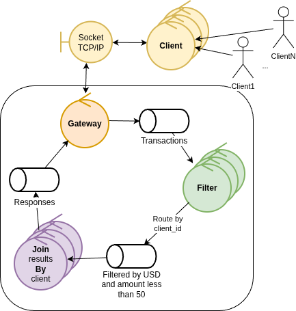{width=80% .center}

El Filter puede correr con múltiples instancias en paralelo, cada una procesando una partición del stream. Dado que el Join también escala horizontalmente, todos los resultados de un mismo cliente deben llegar siempre a la misma instancia del Join. Esto se implementa mediante sharding por `client_id` en la cola de salida del Filter.

La cola de Responses desacopla el Join del Gateway: el Join deposita los resultados en la cola y el Gateway los consume para cerrar la conexión correspondiente.

#### UC2

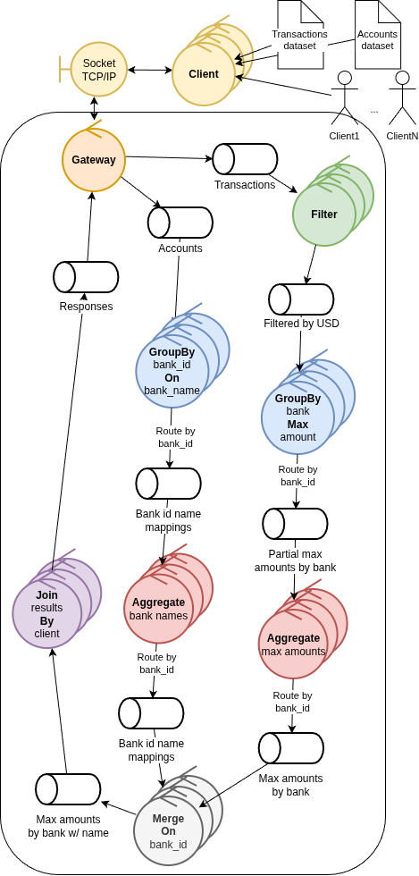{width=75% .center}

El Gateway publica en dos colas distintas: `Transactions` para el stream de transacciones y `Accounts` para el dataset de cuentas.  
Los pipelines para agregar el nombrel de banco y para obtener su monto máximo; corren en paralelo: el `GroupBy bank_id On bank_name` extrae asociaciones `(bank_id, bank_name)` de cada partición y el `Aggregate bank names` las consolida. El resultado se distribuye al Merge con sharding por `bank_id`.  
El `Merge On bank_id` recibe máximos con `bank_id` como clave desde el pipeline de transacciones y nombres de banco desde el pipeline de cuentas.

#### UC3

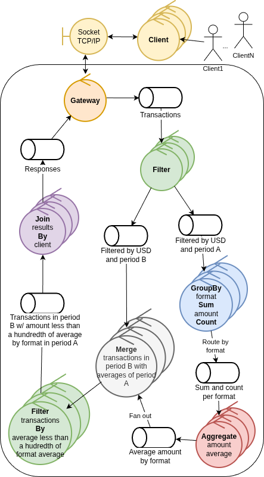{width=80% .center}

El Filter produce dos colas de salida distintas: `Filtered by USD and period A` y `Filtered by USD and period B`. Además de filtrar por currency, rutea cada transacción al pipeline correspondiente según su fecha. Una transacción no puede pertenecer a ambos períodos, por lo que el ruteo es mutuamente exclusivo.  
El pipeline del período A usa shardeo por `format` entre el GroupBy y el Aggregate para que todos los registros del mismo formato lleguen a la misma instancia.  
Los promedios resultantes se distribuyen al Merge mediante *fan-out*: cada resultado del Aggregate se replica a todas las instancias del Merge. Cualquier instancia del Merge puede recibir transacciones del período B de cualquier formato y necesita los promedios de todos los formatos para evaluar la condición; el shardeo enviaría cada promedio a una sola instancia, mientras que el fan-out garantiza que todas tengan el contexto completo. 
El fan-out es aceptable dado que por la naturaleza de los datos del problema no puede haber demasiados formatos de pago; en particular, hay 7 formatos en el dataset de ejemplo entero.

Después del Merge, un segundo Filter aplica la condición `amount < average/100` y produce la cola final hacia el Join.

#### UC4

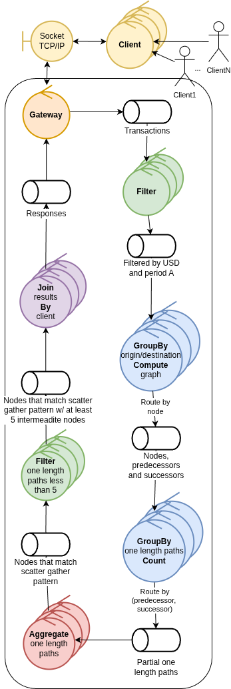{width=75% .center}

El `GroupBy origin/destination Compute graph` genera para cada nodo la lista de predecesores y sucesores; para luego rutear por `node` la información resultante de los grafos a `GroupBy one length paths Count`, cuenta los intermediarios por par `(origin, destination)`.  
Un Filter final descarta los pares cuyo conteo de intermediarios es inferior a 5 y los envía a la cola de resultados del caso de uso, que llega al Join.

#### UC5

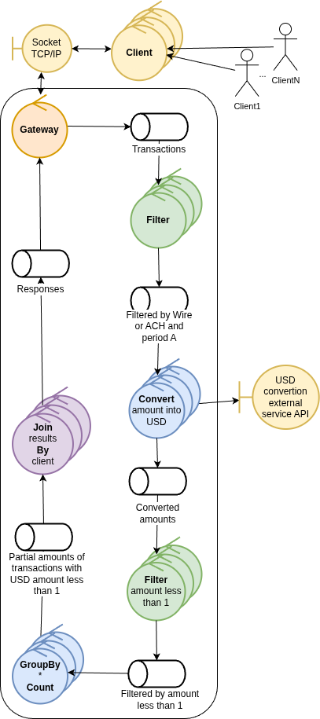{width=80% .center}

El controlador `Convert amount into USD` puede escalar horizontalmente de forma independiente del Filter. Se optó por permitir este escalamiento para más libertad en el despliegue del sistema, pero la operación que se realiza en esta instancia es puramente I/O intensive, y por tanto no requiere mayor poder de cómputo. Se emite una sola request al servicio externo de conversión por batch, amortizando la latencia de red sobre el conjunto del lote.  
El GroupBy produce conteos parciales, uno por instancia, que se terminan shardeando por `client_id` hacia el Join.

#### Overview del sistema completo

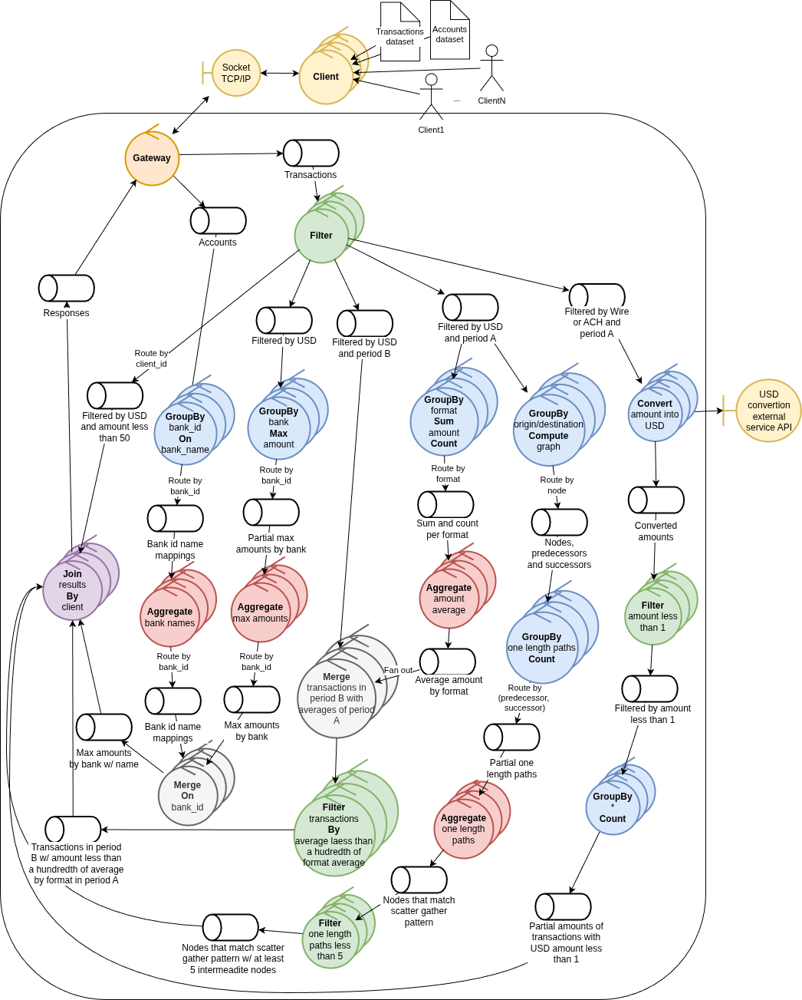{width=90% .center}

El Filter es el nodo con una mayor cantidad de conexiones: recibe el stream completo de transacciones y produce múltiples colas clasificadas por período, formato y moneda. Su escalado horizontal genera una topología many-to-many con los nodos downstream que debe gestionarse a nivel de exchanges y colas del broker.  
Esto se modeló así porque las alternativas que surgieron son:

- Segregar el filtrado en distintas instancias de filter y encadenarlas (por ejemplo filtrar primero por currency USD y después por amount menor a \$50 en el primer caso de uso).
- Segregar *los filtros* en distintas instancias según el filtro a aplicar.

El problema con estas alternativas es que por la naturaleza de los casos de uso, las cantidad de conexiones sería igual de grande, dado que la mayoría requieren primero filtrar por currency USD. Por otro lado, separar el filtrado en múltiples instancias hace que sea necesario recorrer los batches varias veces en vez de sólo una y rutear los registros en los batches de manera acorde. Además, la segunda alternativa es equivalente en robustez a escalar horizontalmente el único controlador Filter por el se terminó optando.

Los ruteos por clave que se realizan hacia algunos de los controladores aggregate o Merge son necesarios para garantizar que todos los registros de un mismo grupo se aggreguen correctamente. Además se realizan en instancias del pipeline en las que se asegura que la cantidad de variantes por las que se hace es tan grande como para seguir aprovechando la estrategia multi-computing.  

El último controlador Join está siempre shardeado por `client_id`, garantizando que todos los resultados parciales de un cliente, provenientes de cualquiera de las cinco pipelines, converjan en la instancia para poder construir la respuesta final.  
Este ruteo no se puede escapar, dado que necesariamente deben agruparse los resultados para cada cliente en algún momento. Pero podría parametrizarse la cantidad de instancias de Join según la cantidad de clientes distintos que se esperan.  

Los nodos Merge (UC2, UC3) son los únicos puntos donde se cruzan pipelines que provienen de fuentes distintas. Fuera de esos dos casos, cada pipeline corre de extremo a extremo sin interacción con las demás.

\newpage

## Despliegue
Para el despliegue del sistema se intentó desacoplar el mismo por completo de la *vista lógica*: el hecho de que dos controladores realicen un filtrado, no debería impactar en la decisión de en qué nodos desplegarlos.  
Dicho esto, en el siguiente diagrama, se muestra cómo podrían desplegarse los procesos del pipeline de la manera más distribuida posible.  
*Es posible que este despliegue se modifique en próximas iteraciones del trabajo, de acuerdo a la relación de robustez que terminen teniendo los controladores en el pipeline.*

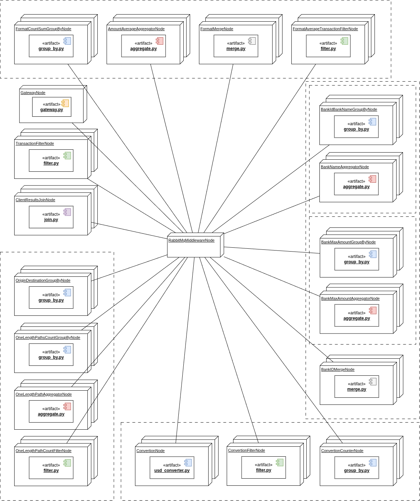{width=90% .center}

\newpage

## Vista de Desarrollo
### Paquetes
Para la distribución de archivos fuente, se optó por mantener un directorio para cada *tipo* de controlador en `controllers/`, con su archivo proceso fuente, su correspondiente Dockerfile y sus dependencias específicas.  
También se centralizaron las dependencias comunes en `common/`, en particular, `net/` y `data/`, que corresponden a la comunicación por red y al modelo de datos con los que interactúan los controladores, respectivamente.

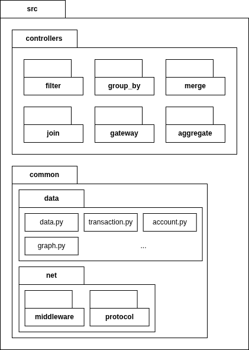{width=70% .center}

La razón por la cuál se pueden generalizar los controladores es el patrón de implementación por el que se optó. Un archivo fuente para levantar el proceso del controlador, que puede ser configurado para filtrar según la implementación de la interfaz que corresponda.  

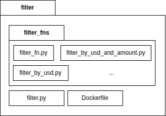{width=70% .center}

Por ejemplo, el código fuente para un Filter consta  
del controlador
```py
class Filter:
    def __init__(self,filter_fn: FilterFn):
        # ...
```

de la interfaz para la función de filtro
```py
class FilterFn:
    @abstractmethod
    def filter(self, list[Data]) -> list[Data]:
        pass
```

y de la implementación particular del filtro que se quiera correr
```py
class FilterByCurrecyUSD:
    def filter(self, list[Transaction]) -> list[Transaction]:
        # ...
```

En este ejemplo también se puede observar el uso de la interfaz `Data` y una implementación `Transaction` para la misma.

\newpage

## Vista de Procesos
### Actividades

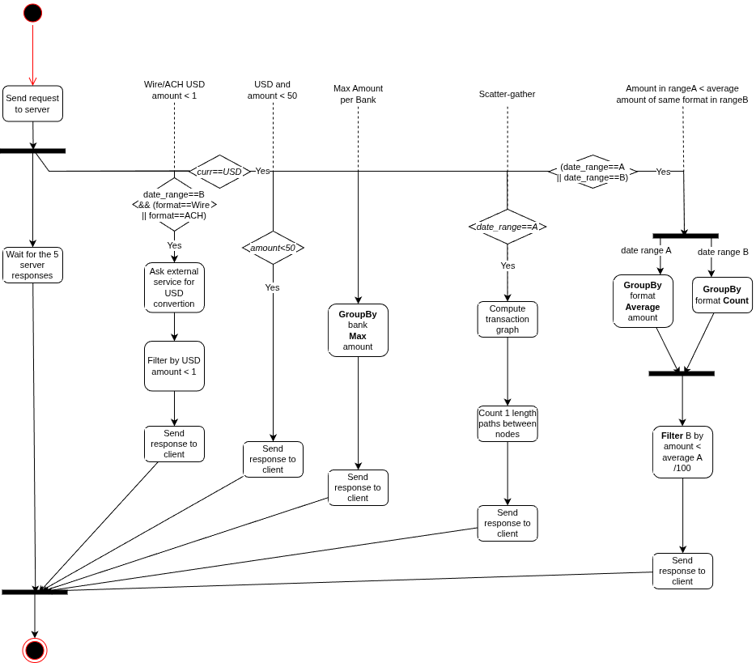{width=90% .center}

#### UC1

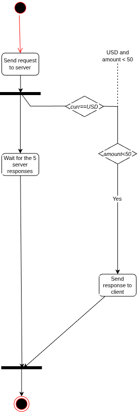{width=70% .center}

#### UC2

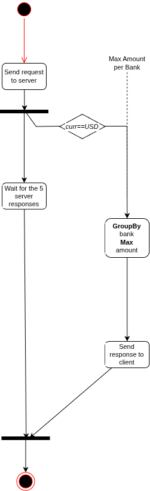{width=70% .center}

#### UC3

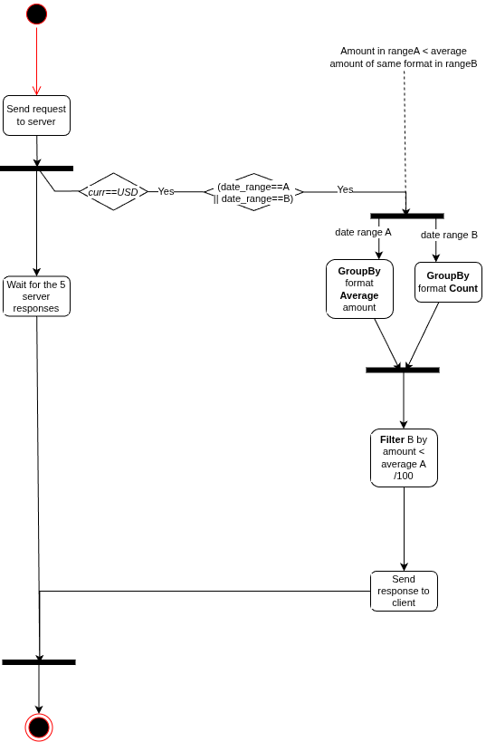{width=70% .center}

#### UC4

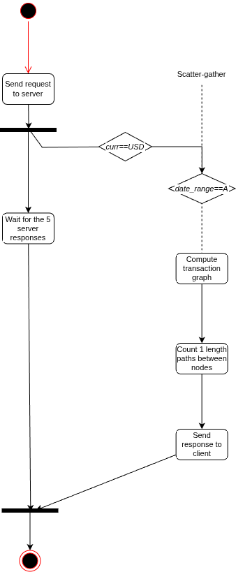{width=70% .center}

#### UC5

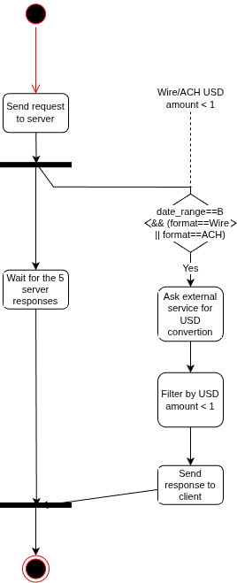{width=70% .center}

### Secuencia

#### UC1

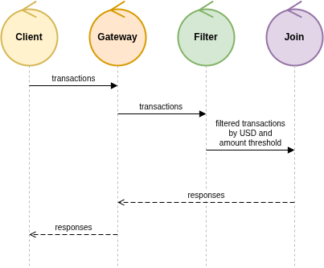{width=90% .center}

#### UC2

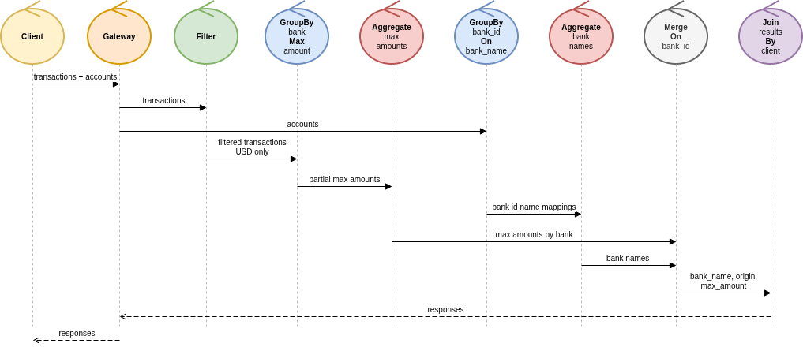{width=90% .center}

#### UC3

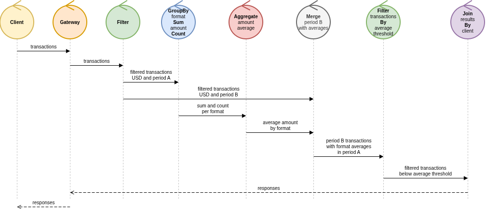{width=90% .center}

#### UC4

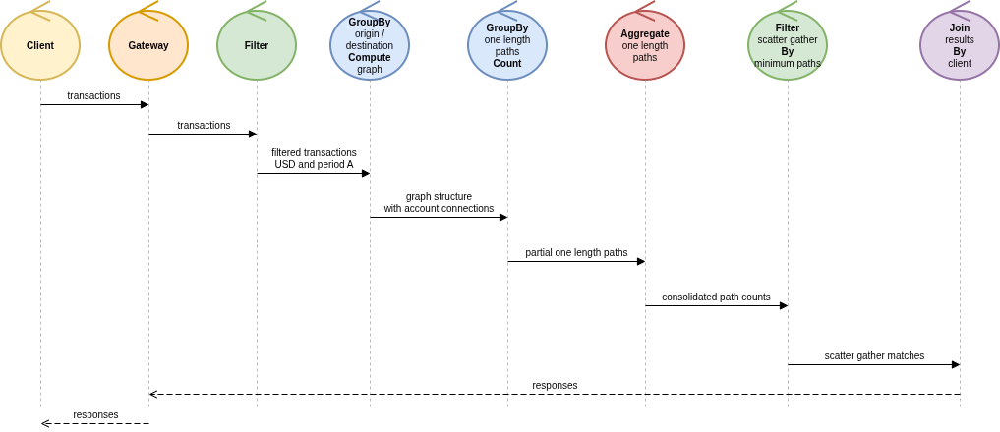{width=90% .center}

#### UC5

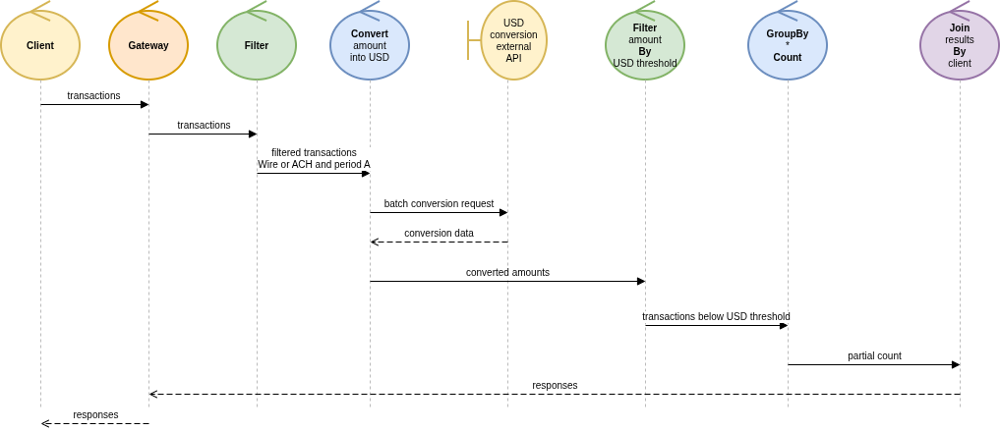{width=90% .center}

\newpage

# Desarrollo

## Tareas a realizar
Para el desarrollo del trabajo, se decidió que cada uno de los integrantes realice la implementación de uno o más casos de uso de punta a punta; con el objetivo de que todos podamos tener un seguimiento del total funcionamiento del sistema, pero sin la necesidad de entrar de lleno en los detalles específicos de cada caso de uso.

## Asignación
Aquellas tareas de las que dependan todas los casos, serán desarrolladas en una primera implementación por todos los miembros del equipo, y serán modificadas como se requiera por quien lo necesite a lo largo de la continuación del trabajo.  
El primer caso de uso será desarrollado en gran medida con la dinámica de *ping-pong pair-programming*; con el objetivo de usar el caso más simple para la interiorización de la implementación del trabajo para todos los miembros del equipo en paralelo.  
El resto de ítems quedan divididos de la siguiente manera:

- UC1: Todos
- UC2: Lorenzo Minervino
- UC3: Valsagna Federico.
- UC4: Ordoñez Alejo.
- UC5: Lorenzo Minervino.
