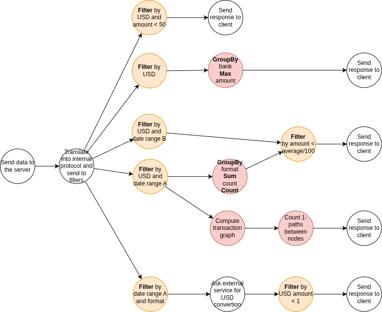

# Arquitectura del sistema

El sistema recibe un conjunto de datos de transacciones bancarias desde uno o más clientes simultáneamente y devuelve los resultados de cinco análisis distintos. La diversidad de los requerimientos — que abarcan desde un filtro simple hasta la detección de patrones en grafos y la consulta a servicios externos — motivó el diseño de una arquitectura de procesamiento distribuido en pipeline, donde cada caso de uso recorre una cadena de nodos especializados de forma concurrente con los demás.

## Casos de uso

Una petición del cliente hace que el sistema procese los 5 casos de uso:

### UC1
Transacciones en USD con monto menor a 50.

### UC2
Monto de la máxima transacción en USD para cada banco.

### UC3
Transacciones en USD en el período 2022-09-06 al 2022-09-15 (período B), cuyo monto sea menor a un centésimo del promedio de monto para su formato en el período 2022-09-01 al 2022-09-05 (período A).

### UC4
Cuentas que cumplan con el patrón *scatter-gather* con una cuenta de separación y una cantidad mínima de cuentas intermedias igual a 5; en el período A.

### UC5
Cantidad de transacciones con formato de pago *Wire* o *ACH* en el período A, cuyo monto en USD sea menor a 1.

{width=50%}

Los cinco casos de uso presentan niveles crecientes de complejidad: desde un filtro directo (UC1) hasta la detección de estructuras en un grafo de transacciones (UC4) o la delegación a un servicio externo de conversión de moneda (UC5). Esta escalera de complejidad es la que da forma a la arquitectura del sistema y se verá reflejada en cada una de las vistas que siguen.

\newpage

## Vista física

La vista física describe qué componentes existen en el sistema, cómo se relacionan entre sí y cómo se despliegan en la infraestructura.

### Robustez

El siguiente diagrama muestra el sistema completo con todos los pipelines activos en paralelo. El flujo base es siempre el mismo: el cliente envía datos al **Gateway** por TCP/IP; el Gateway los distribuye a los nodos de procesamiento a través del broker de mensajería (RabbitMQ); los resultados parciales convergen en el **Join**, que los devuelve al cliente.

Previo a enviarse al Join, los mensajes se routean por ID de cliente. Dado que el Join puede escalar horizontalmente, este sharding garantiza que todos los resultados parciales de un mismo cliente lleguen siempre a la misma instancia del Join, que es la única que puede ensamblar la respuesta final completa.

{width=90%}

Cada uno de los cinco casos de uso corresponde a un pipeline independiente. A continuación se describe cada uno en detalle, comenzando por el más simple para ir incorporando los conceptos progresivamente.

#### UC1 — Filtro directo

{width=90%}

UC1 establece el patrón base del sistema. Las transacciones llegan al **Filter**, que aplica la regla de negocio (moneda USD y monto menor a $50) y envía los resultados directamente al **Join**. Esta cadena de tres etapas — Gateway → Filter → Join — es el esqueleto sobre el que se construyen todos los demás casos de uso. El Filter puede tener múltiples instancias corriendo en paralelo (indicado por el símbolo apilado en el diagrama), lo que permite escalar horizontalmente el procesamiento de datos.

Dado que los datos se particionan en batches que pueden ser procesados por distintas instancias del Filter en paralelo, el manejo correcto de los mensajes EOF es crítico: una instancia solo puede propagar el EOF al Join cuando haya terminado de procesar todos los batches del cliente correspondiente, evitando así errores de desincronización en la consolidación de la respuesta final.

El Filter centraliza todas las decisiones de ruteo, lo que lo convierte en un potencial cuello de botella. Una alternativa considerada fue encadenar filtros especializados en serie: un primer nodo filtraría por USD y luego distribuiría a múltiples filtros, uno por caso de uso. Sin embargo, este diseño no eliminaba la duplicación de datos — una misma transacción puede satisfacer varios casos de uso simultáneamente, por lo que inevitablemente debe enviarse a múltiples nodos downstream independientemente del diseño elegido. El problema concreto de la alternativa encadenada era otro: los datos recorrerían la red un salto extra antes de llegar a destino, incrementando innecesariamente el tráfico. La solución adoptada centraliza el ruteo en un único Filter que decide en O(1) por línea y por batch a qué canales corresponde cada mensaje, enviando los datos directamente a sus destinos finales sin pasos intermedios. El riesgo de cuello de botella se mitiga escalando el Filter horizontalmente. No obstante, este escalado introduce una complejidad adicional: cada instancia necesita mantener conexiones con múltiples nodos downstream que también pueden escalar (GroupBys, filtros posteriores), generando una topología many-to-many de conexiones que debe gestionarse correctamente a nivel de colas y exchanges del broker.

#### UC2 — Máximo por banco

{width=90%}

UC2 extiende el patrón de UC1 incorporando una etapa de agregación distribuida. Luego de filtrar por moneda USD, es necesario calcular el monto máximo por banco sobre el conjunto completo de datos, lo que no puede resolverse con un único Filter que vea solo una partición. Para esto se introduce el par **GroupBy + Aggregate**: el GroupBy calcula máximos locales dentro de cada partición, y el Aggregate consolida esos resultados parciales en el valor global definitivo.

El GroupBy recibe los datos ya filtrados en batches y calcula un máximo local por banco dentro de cada uno. A continuación, los resultados se shardean por banco para distribuir la carga entre las distintas instancias del Aggregate — ya que este también puede escalar horizontalmente. Shardear por banco en esta segunda etapa garantiza que cada instancia del Aggregate concentre todos los datos de un mismo banco, asegurando que el máximo calculado sea globalmente correcto. Además, la variedad de bancos en el dataset es lo suficientemente alta como para ser una clave de distribución eficaz, evitando hotspots. Con ambas etapas escalando horizontalmente de forma independiente, el sistema distribuye la carga de manera consistente sin comprometer la correctitud del resultado.

#### UC3 — Comparación entre períodos

{width=90%}

> **[UC3 — Pendiente Fede]** *Describir el diseño de este caso de uso.*

#### UC4 — Patrón scatter-gather

{width=90%}

> **[UC4 — Pendiente Alejo]** *Describir el diseño de este caso de uso.*

#### UC5 — Conversión de moneda con servicio externo

{width=90%}

UC5 introduce una dependencia externa al sistema. Las transacciones de interés pueden estar expresadas en cualquier moneda, por lo que antes de aplicar el umbral de $1 USD es necesario convertirlas. Esta conversión se delega a un **USD Converter API** externo: el nodo `to_USD and Filter` consulta ese servicio por la tasa de cambio correspondiente, convierte el monto y luego aplica el filtro.

La etapa de conversión a USD se implementa como un worker separado del Filter general por una razón de rendimiento: realizar una request a una API externa introduce una latencia variable que bloquearía el procesamiento del resto de los filtros si se ejecutara en el mismo nodo. Al separarlo en un worker posterior dedicado, el Filter general continúa procesando a su velocidad natural mientras el ConverterNode maneja la comunicación externa de forma aislada. La conversión se realiza por batch: se emite una única request a la API por lote de transacciones, asumiendo que el tipo de cambio es invariante dentro del intervalo de tiempo que tarda en procesarse un batch. Esta suposición es razonable dado el volumen de datos y la escala temporal de las transacciones analizadas.

\newpage

### Despliegue

Una vez establecidos los componentes lógicos de cada pipeline, el diagrama de despliegue muestra cómo estos se agrupan en nodos físicos y qué protocolos de comunicación los vinculan:

{width=90%}

El sistema se compone de seis tipos de nodos:

- **GatewayNode**: punto de entrada TCP/IP para los clientes. Traduce las peticiones al protocolo interno y las publica en el broker.
- **BrokerNode**: instancia de RabbitMQ que actúa como intermediario de mensajes entre todos los nodos de procesamiento mediante AMQP 0-9-1.
- **FilterNode**: aplica las reglas de filtrado y ruteo (`filter_and_route.py`, `average_amount_and_filter.py`, `to_usd_and_filter.py`). Para UC5 se comunica con el ConverterNode mediante la API de conversión USD.
- **MapperNode**: realiza transformaciones y agrupaciones locales (`group_by_bank_max_amount.py`, `group_by_format_count.py`, `compute_transaction_graph.py`, `count_one_length_paths.py`).
- **AggregationNode**: consolida los resultados parciales de los MapperNodes (`aggregate_bank_amount.py`, `aggregate_format_sum_count.py`, `aggregate_one_length_paths_count.py`).
- **ConverterNode**: encapsula la lógica de conversión de moneda, expuesta como API hacia el FilterNode.

\newpage

## Vista de procesos

La vista de procesos describe el comportamiento dinámico del sistema: cómo fluyen los datos a través de los componentes y en qué orden ocurren las interacciones entre ellos.

### DAG de procesamiento

El conjunto de pipelines puede modelarse como un **DAG** (*Directed Acyclic Graph*): un grafo dirigido sin ciclos donde cada nodo representa un componente de procesamiento y cada arista representa el flujo de datos entre ellos. La ausencia de ciclos garantiza que el procesamiento siempre converge y permite razonar sobre dependencias entre etapas: un nodo solo puede comenzar a procesar cuando todos sus predecesores han producido su salida.

{width=90%}

El DAG muestra con claridad cómo los cinco pipelines comparten los nodos iniciales (Gateway y la etapa de filtrado primario) y luego se bifurcan según las necesidades de cada caso de uso. Esta bifurcación es lo que habilita la ejecución concurrente.

### Actividades

El diagrama de actividades general muestra el flujo desde la perspectiva del cliente: este envía una única petición y espera cinco respuestas independientes. Internamente, los cinco pipelines se activan en paralelo (fork) y el cliente solo recibe respuesta cuando todos han finalizado (join):

{width=90%}

A continuación se detalla el flujo de actividades y las interacciones entre componentes para cada caso de uso por separado.

### Secuencia y actividades por caso de uso

Para cada caso de uso se presentan en conjunto el diagrama de actividades — que describe la lógica de decisión y el procesamiento — y el diagrama de secuencia — que muestra los mensajes intercambiados entre los componentes a lo largo del tiempo. Ambas vistas son complementarias: la primera responde *qué* se hace, la segunda responde *quién le habla a quién*.

#### UC1

El caso más simple: un único Filter evalúa dos condiciones sobre cada transacción y el resultado va directo al Join.

{width=70%}

{width=90%}

El flujo de mensajes es lineal: el cliente envía las transacciones al Gateway, el Gateway las enruta al Filter, el Filter devuelve el subconjunto filtrado al Join, y el Join responde al cliente. Este es el camino más corto posible dentro de la arquitectura.

#### UC2

{width=70%}

{width=90%}

Se suman dos participantes respecto de UC1: el GroupBy Bank y el Aggregator, que introducen el patrón de agregación distribuida en dos etapas. El Filter entrega las transacciones USD al GroupBy, que calcula el máximo local por banco. El Aggregator combina todos los máximos locales para obtener el máximo global definitivo, que luego el Join devuelve al cliente.

#### UC3

{width=70%}

{width=90%}

> **[UC3 — Pendiente Fede]** *Describir el flujo de este caso de uso.*

#### UC4

{width=70%}

{width=90%}

> **[UC4 — Pendiente Alejo]** *Describir el flujo de este caso de uso.*

#### UC5

El caso de uso que introduce una dependencia externa: antes de poder evaluar el umbral de monto, el sistema debe convertir cada transacción a USD consultando un servicio externo.

{width=70%}

{width=90%}

El Filter inicial selecciona las transacciones del período A con formato Wire o ACH. Para cada batch, el nodo `Ask external service` consulta al External Service la tasa de conversión correspondiente, convierte los montos a USD y aplica el filtro de monto menor a $1. El resultado va al Join, que responde al cliente.

\newpage

## Vista de desarrollo

La vista de desarrollo describe cómo está organizado el código fuente y qué abstracciones de comunicación utiliza la implementación.

### Paquetes

{width=70%}

El código fuente se organiza bajo el paquete raíz `src` en siete módulos principales: `filter`, `group_by`, `aggregation`, `mapper`, `gateway`, `comms` y `rabbitmq`. La separación entre módulos refleja directamente la separación de responsabilidades identificada en la vista física: cada tipo de nodo tiene su propio módulo con la lógica de negocio correspondiente, mientras que `comms` y `rabbitmq` encapsulan la infraestructura de comunicación compartida por todos.

### Mensajes

La comunicación entre nodos se realiza a través de mensajes serializados que viajan por el broker. La clase abstracta `Message` define la interfaz común de serialización y deserialización, de la que heredan los tipos concretos de mensajes del sistema:

{width=60%}

El tipo `EOF` es un mensaje especial que señaliza el fin de un stream de datos, permitiendo que cada nodo downstream sepa cuándo recibió la totalidad de los datos de su upstream y puede proceder a emitir sus propios resultados.

### Middleware de comunicación

El acceso a RabbitMQ está abstraído por la interfaz `Middleware`, con dos implementaciones concretas:

{width=60%}

- **QueueMiddleware**: para comunicación punto-a-punto entre un productor y un consumidor.
- **ExchangeMiddleware**: para distribución de mensajes a múltiples consumidores, utilizado cuando los datos deben ser procesados en paralelo por varias instancias del mismo nodo (por ejemplo, múltiples instancias del Filter).

Esta abstracción permite que la lógica de negocio de cada nodo sea independiente del mecanismo de transporte subyacente, facilitando tanto el testing como futuros cambios de broker.

\newpage

# Desarrollo

## Tareas a realizar
Para el desarrollo del trabajo, se decidió que cada uno de los integrantes realice la implementación de uno o más casos de uso de punta a punta; con el objetivo de que todos podamos tener un seguimiento del total funcionamiento del sistema, pero sin la necesidad de entrar de lleno en los detalles específicos de cada caso de uso.

## Asignación
Aquellas tareas de las que dependan todas los casos, serán desarrolladas en una primera implementación por todos los miembros del equipo, y serán modificadas como se requiera por quien lo necesite a lo largo de la continuación del trabajo.  
El primer caso de uso será desarrollado en gran medida con la dinámica de *ping-pong pair-programming*; con el objetivo de usar el caso más simple para la interiorización de la implementación del trabajo para todos los miembros del equipo en paralelo.  
El resto de ítems quedan divididos de la siguiente manera:

- UC1: Todos
- UC2: Lorenzo Minervino
- UC3: Valsagna Federico.
- UC4: Ordoñez Alejo.
- UC5: Lorenzo Minervino.
